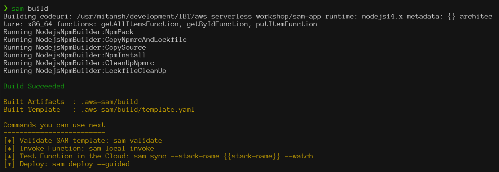
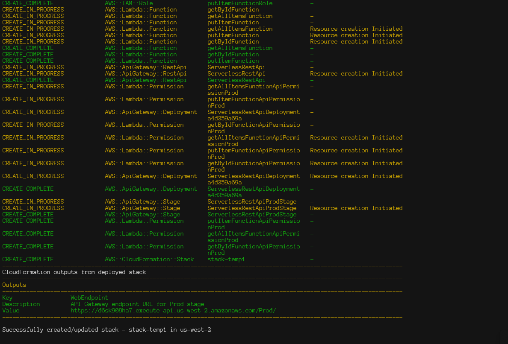
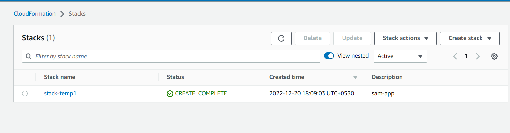

# <u>Serverless Application using SAM</u>

The below Documentation is made based on the learnings from the AWS community day workshop attainded  at Ahmedabad on date 18/12/2022.

Special thanks to below organizations :

```bash
1. DataVizz
2. Thundra
3. Serverless Guru
4. AWS community Ahmedabad  
```

## [What is Serverless]((https://aws.amazon.com/serverless/))

Serverless is a cloud application development and execution model that lets developers build and run code without managing servers, and without paying for idle cloud infrastructure.

Serverless computing offerings typically fall into two groups, Backend-as-a-Service (BaaS) and Function-as-a-Service (FaaS).  

With serverless, developers never pay for idle capacity. The cloud provider spins up and provisions the required computing resources on demand when the code executes, and spins them back down again—called ‘scaling to zero’—when execution stops. The billing starts when execution starts, and ends when execution stops; typically, pricing is based on execution time and resources required.

'Serverless' describes the developer’s experience with those servers—they are are invisible to the developer, who doesn't see them, manage them, or interact with them in any way.

## What are the pros and cons of serverless computing?

### Pros

- <b>Improved developer productivity:</b> As noted above, serverless enables development teams to focus on writing code, not managing infrastructure. It gives developers much more time to innovate and optimize their front-end application functionality and business logic.
- <b>Pay for execution only:</b> The meter starts when the request is made, and ends when execution finishes. Compare this to the infrastructure as a service (IaaS) compute model, where customers pay for the physical servers, virtual machines (VMs) and other resources required to run applications, from the time they provision those resources until the time they explicitly decommission them.
- <b>Develop in any language:</b> Serverless is a polyglot environment, enabling developers to code in any language or framework—Java, Python, JavaScript, node.js—with which they're comfortable.
- <b>Streamlined development/DevOps cycles.</b> Serverless simplifies deployment and, in a larger sense, simplifies DevOps because developers don't spend time defining infrastructure required to integrate, test, deliver and deploy code builds into production.
- <b>Cost-effective performance.</b> For certain workloads—embarrassingly parallel processing, stream processing, certain data processing tasks—serverless computing can be both faster and more cost-effective than other forms of compute.
- <b>Usage visibility.</b> Serverless platforms provide near-total visibility into system and user times and can aggregate usage information systematically.

### Cons

- Not running your own server or controlling your own server-side logic can have drawbacks.
- Cloud providers may have strict constraints on how their components can be interacted with, in turn affecting how flexible and customized your own systems can be. In the case of BaaS environments, developers may be beholden to services whose code is outside their control.
- Ceding control of these aspects of your IT stack also opens you up to vendor lock-in. Deciding to change providers will also likely come with the cost of upgrading your systems to adhere to the new vendor’s specifications.

## What is [SAM](https://docs.aws.amazon.com/serverless-application-model/latest/developerguide/what-is-sam.html) (Serverless Application Model)

The AWS Serverless Application Model (AWS SAM) is an open-source framework that you can use to build serverless applications on AWS.

### Why use SAM?

Because AWS SAM integrates with other AWS services, creating serverless applications with AWS SAM provides the following benefits:

- AWS SAM makes it easy to organize related components and resources, and operate on a single stack. You can use AWS SAM to share configuration (such as memory and timeouts) between resources, and deploy all related resources together as a single, versioned entity.

- Because AWS SAM is an extension of AWS CloudFormation, you get the reliable deployment capabilities of AWS CloudFormation. You can define resources by using AWS CloudFormation in your AWS SAM template. Also, you can use the full suite of resources, intrinsic functions, and other template features that are available in AWS CloudFormation.

- With a few lines of configuration, you can enable safe deployments through CodeDeploy, and can enable tracing by using AWS X-Ray.

- Local debugging and testing. The AWS SAM CLI lets you locally build, test, and debug serverless applications that are defined by AWS SAM templates. The CLI provides a Lambda-like execution environment locally. It helps you catch issues upfront by providing parity with the actual Lambda execution environment. To step through and debug your code to understand what the code is doing.

- To build a deployment pipeline for your serverless applications, you can use CodeBuild, CodeDeploy, and CodePipeline. You can also use AWS CodeStar to get started with a project structure, code repository, and a CI/CD pipeline that's automatically configured for you. To deploy your serverless application, you can use the Jenkins plugin.

### AWS SAM Installation

- Create AWS account, set IAM, save the credential file generated (Excel file)

- Installing or updating the latest version of the [AWS CLI](https://docs.aws.amazon.com/cli/latest/userguide/getting-started-install.html) version on your computer.

> To check if you have the AWS CLI installed, run the aws --version command.

- Installing the [AWS SAM CLI](https://docs.aws.amazon.com/serverless-application-model/latest/developerguide/install-sam-cli.html)

    ``` pip install aws-sam-cli ```
    <br>``` sam --version ```

## Diffrent opponents of SAM [link](https://dev.to/tastefulelk/serverless-framework-vs-sam-vs-aws-cdk-1g9g#:~:text=AWS%20SAM%20Much%20like%20Serverless%20Framework%2C%20SAM%20%28or,CLI%20which%20is%20installed%20globally%20on%20your%20system.)

### [Serverless Framework](https://www.serverless.com/framework/docs)

- The preferred way to run the Serverless CLI is to install it as a (dev)dependency in your project by running yarn add serverless -D and then all that's missing is a serverless.yml file which is used to define your application and its infrastructure.
- devs struggle with understanding where the line between Serverless configuration and CloudFormation configuration actually or why they have to change the syntax in the middle of the file
- Simple configuration with neat variable support
- Great debugging and testing utilities
- Hard to share configuration and components

### AWS SAM and [SAM Commands](https://docs.aws.amazon.com/serverless-application-model/latest/developerguide/serverless-sam-cli-command-reference.html)

- SAM comes loaded with utility features to test and debug your app
- The configuration is a bit verbose but luckily the CLI can help you with a place to start by running sam init and answering a few questions about what your planning to build.
- Well integrated with AWS build pipelines
- Great debugging and testing utilities
- Verbose configuration

<kbd></kbd>

### [AWS CDK](https://docs.aws.amazon.com/cdk/v2/guide/getting_started.html)

- Isn't purely a tool for creating serverless apps, rather it's a full-blown infrastructure-as-code framework that allows you to use code, __not config__, to define your application.
- Enables sharing & re-use of components
- Makes the infrastructure testable
- Need to use another tool, such as SAM or the AWS CLI, if you want to invoke or print the logs of a deployed function.

## Create Project Using SAM

Download a sample application

### ``` 1. sam init ```

This command creates a directory with the name that you provided as the project name.

<kbd></kbd>

<kbd></kbd>

<kbd></kbd>

The contents of the project directory are similar to the following:

```bash
 sam-app/
   ├── README.md
   ├── events/
   │   └── event.json
   ├── hello_world/
   │   ├── __init__.py
   │   ├── app.py            #Contains your AWS Lambda handler logic.
   │   └── requirements.txt  #Contains any Python dependencies the application requires, used for sam build
   ├── template.yaml         #Contains the AWS SAM template defining your application's AWS resources.
   └── tests/
       └── unit/
           ├── __init__.py
           └── test_handler.py
```

### ``` 2. sam build ```

The sam build command builds any dependencies that your application has. It also copies your application source code to folders under .aws-sam/build to be zipped and uploaded to Lambda.

```bash
Build Succeeded

 Built Artifacts  : .aws-sam/build
 Built Template   : .aws-sam/build/template.yaml

 Commands you can use next
 =========================
 [*] Invoke Function: sam local invoke
 [*] Deploy: sam deploy --guided
       
```

```bash
 .aws-sam/
   └── build/
       ├── HelloWorldFunction/
       └── template.yaml
```

<kbd></kbd>

### [Understand .yml File](https://docs.aws.amazon.com/serverless-application-model/latest/developerguide/sam-specification-template-anatomy.html)

<kbd></kbd>

- This is the SAM template that represents the architecture of your serverless application.
- The AWSTemplateFormatVersion identifies the capabilities of the template
- Description (optional) A text string that describes the template. This section corresponds directly with the Description section of AWS CloudFormation templates.
- Transform section specifies one or more macros that AWS CloudFormation uses to process your template
- Resources declares the AWS resources that you want to include in the stack
- The Globals section is unique to AWS SAM. It defines properties that are common to all your serverless functions and APIs.
- Outputs : The values that are returned whenever you view your stack's properties. For example, you can declare an output for an S3 bucket name, and then call the aws cloudformation describe-stacks AWS Command Line Interface (AWS CLI) command to view the name.

__Resources__ declares the AWS resources that you want to include in the stack. In AWS SAM templates the Resources section can contain a combination of AWS CloudFormation resources and AWS SAM resources.

<kbd></kbd>

### Adding Dynamo DB

```yml
Resources:
  # DynamoDB table to store item: {id: &lt;ID&gt;, name: &lt;NAME&gt;}
  SampleTable:
    Type: AWS::Serverless::SimpleTable
    Properties:
      PrimaryKey:
        Name: id
        Type: String
      ProvisionedThroughput:
        ReadCapacityUnits: 2
        WriteCapacityUnits: 2
```

### Adding Lambda Function

```yml

Resources:
  # Each Lambda function is defined by properties:
  # https://github.com/awslabs/serverless-application-model/blob/master/versions/2016-10-31.md#awsserverlessfunction

  # This is a Lambda function config associated with the source code: get-all-items.js
  getAllItemsFunction:
    Type: AWS::Serverless::Function
    Properties:
      Handler: src/handlers/get-all-items.getAllItemsHandler
      Runtime: nodejs14.x
      Architectures:
        - x86_64
      MemorySize: 128
      Timeout: 100
      Description: A simple example includes a HTTP get method to get all items from a DynamoDB table.
      Policies:
        # Give Create/Read/Update/Delete Permissions to the SampleTable
        - DynamoDBCrudPolicy:
            TableName: !Ref SampleTable
      Environment:
        Variables:
          # Make table name accessible as environment variable from function code during execution
          SAMPLE_TABLE: !Ref SampleTable
      Events:
        Api:
          Type: Api
          Properties:
            Path: /
            Method: GET
  # Each Lambda function is defined by properties:
  # https://github.com/awslabs/serverless-application-model/blob/master/versions/2016-10-31.md#awsserverlessfunction

  # This is a Lambda function config associated with the source code: get-by-id.js
  getByIdFunction:
    Type: AWS::Serverless::Function
    Properties:
      Handler: src/handlers/get-by-id.getByIdHandler
      Runtime: nodejs14.x
      Architectures:
        - x86_64
      MemorySize: 128
      Timeout: 100
      Description: A simple example includes a HTTP get method to get one item by id from a DynamoDB table.
      Policies:
        # Give Create/Read/Update/Delete Permissions to the SampleTable
        - DynamoDBCrudPolicy:
            TableName: !Ref SampleTable
      Environment:
        Variables:
          # Make table name accessible as environment variable from function code during execution
          SAMPLE_TABLE: !Ref SampleTable
      Events:
        Api:
          Type: Api
          Properties:
            Path: /{id}
            Method: GET
  # Each Lambda function is defined by properties:
  # https://github.com/awslabs/serverless-application-model/blob/master/versions/2016-10-31.md#awsserverlessfunction

  # This is a Lambda function config associated with the source code: put-item.js
  putItemFunction:
    Type: AWS::Serverless::Function
    Properties:
      Handler: src/handlers/put-item.putItemHandler
      Runtime: nodejs14.x
      Architectures:
        - x86_64
      MemorySize: 128
      Timeout: 100
      Description: A simple example includes a HTTP post method to add one item to a DynamoDB table.
      Policies:
        # Give Create/Read/Update/Delete Permissions to the SampleTable
        - DynamoDBCrudPolicy:
            TableName: !Ref SampleTable
      Environment:
        Variables:
          # Make table name accessible as environment variable from function code during execution
          SAMPLE_TABLE: !Ref SampleTable
      Events:
        Api:
          Type: Api
          Properties:
            Path: /
            Method: POST
  # Simple syntax to create a DynamoDB table with a single attribute primary key, more in
  # https://github.com/awslabs/serverless-application-model/blob/master/versions/2016-10-31.md#awsserverlesssimpletable

```

### ``` 3. sam validate ```

Verifies whether an AWS SAM template file is valid.
<kbd></kbd>

### ``` 4. sam deploy --guided ```

This command deploys your application to the AWS Cloud. It takes the deployment artifacts that you build with the sam build command, packages and uploads them to an Amazon Simple Storage Service (Amazon S3) bucket that the AWS SAM CLI creates, and deploys the application using AWS CloudFormation. In the output of the sam deploy command, you can see the changes being made to your AWS CloudFormation stack.

If your application created an HTTP endpoint, the outputs that sam deploy generates also show you the endpoint URL for your test application

<kbd></kbd>

<kbd></kbd>

<kbd></kbd>

<kbd></kbd>

### ``` 5. Check Deployment Success or not ```


Cloud Formation Stack generated in AWS.
<kbd></kbd>

Dynamo DB table generated in AWS.
<kbd></kbd>

Lambda functions generated in AWS.
<kbd></kbd>

Lets go inside our lambda function
<kbd></kbd>

This api points will be available in all the lambda functions. This api's can be used to test the functions from postman.

The logs of the apis can be reviewed from cloudWatch.

